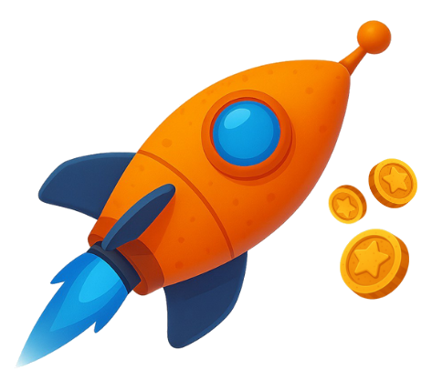
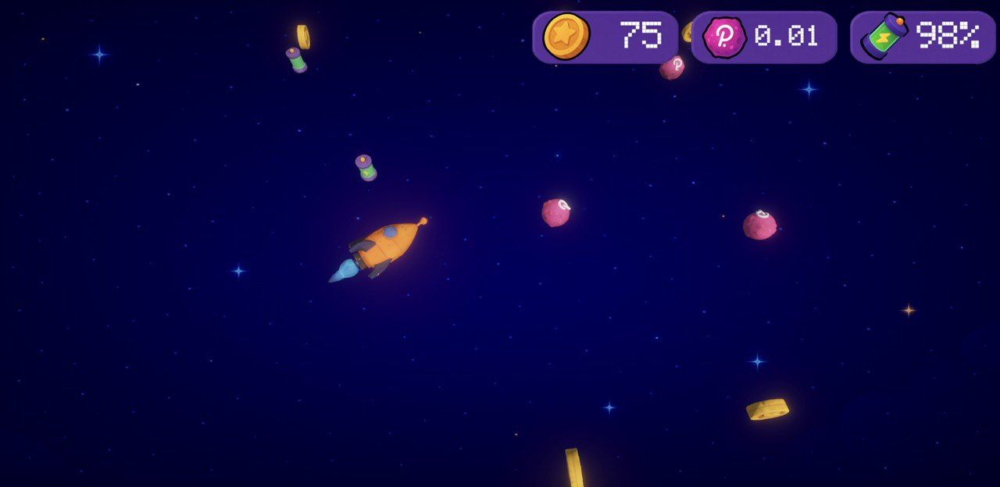
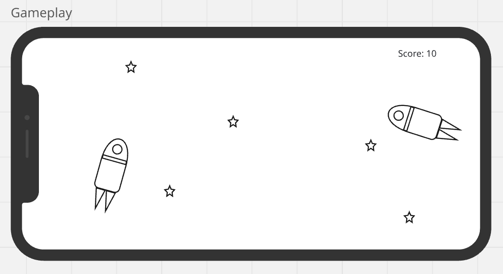
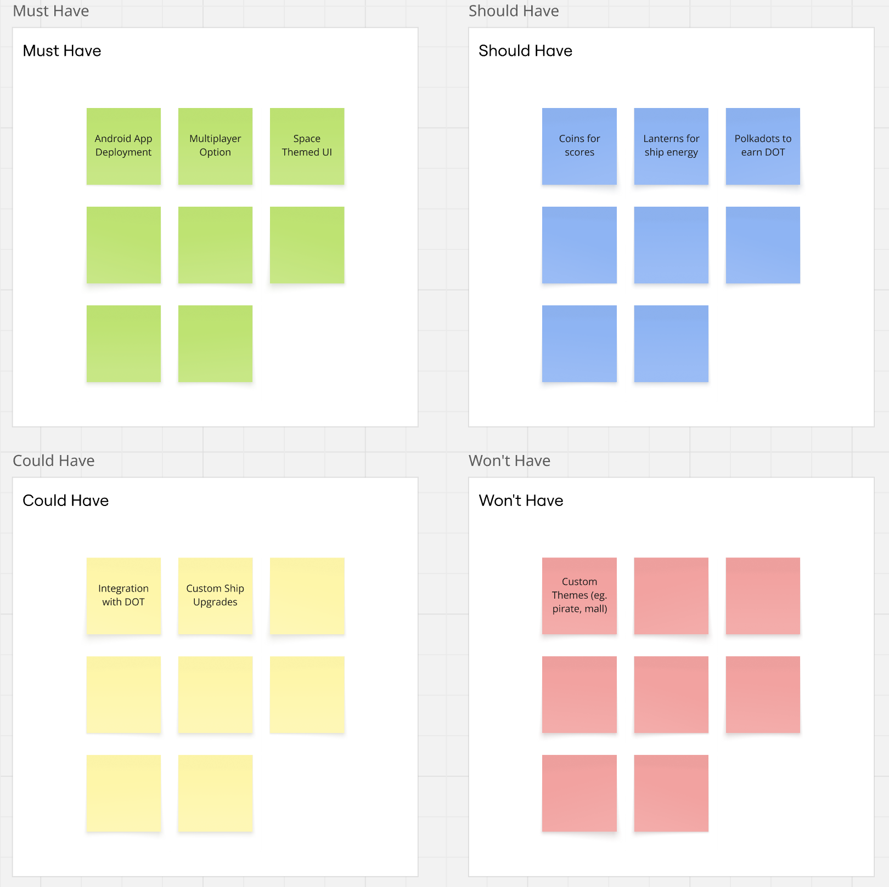
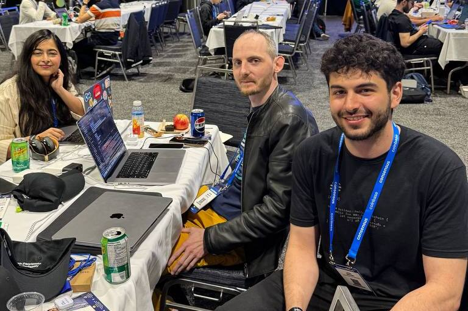

<a id="readme-top"></a>

<!-- PROJECT LOGO -->
<br />
<div align="center">
  <a href="https://github.com/rio900/on-chain-game">
    
  </a>

  <h3 align="center">DotStriker!</h3>

  <p align="center">
    Even aliens need financial backing to invade space! Challenge your friends to join your orbit and race to collect the most coins in the galaxy. Get Striking! 🚀
    <br />
    <a href="https://github.com/rio900/on-chain-game/blob/main/README.md"><strong>Explore the docs »</strong></a>
    <br />
    <br />
    <a href="#gameplay-demo">View Demo</a>
    &middot;
    <a href="#contributing">Contribute</a>
  </p>
</div>

<!-- TABLE OF CONTENTS -->
<details>
  <summary>Table of Contents</summary>
  <ol>
    <li>
      <a href="#about-the-project">About The Project</a>
      <ul>
        <li><a href="#built-with-">Built With ♡</a></li>
        <li><a href="#why-polkadot">Why Polkadot?</a></li>
      </ul>
    </li>
    <li>
      <a href="#dotstriker-simulation-a-demo">DotStriker! Simulation: A Demo</a>
      <ul>
        <li><a href="#building-demo">Building DotStriker!</a></li>
        <li><a href="#playing-dotstriker">Playing DotStriker!</a></li>
      </ul>
    </li>
    <li><a href="#ui-design">UI Design</a></li>
      <ul>
        <li><a href="#screenshots">Screenshots</a></li>
        <li><a href="#wireframes">Wireframes</a></li>
      </ul>
    <li><a href="#roadmap">Roadmap</a></li>
    <li><a href="#future-releases">Future Releases</a></li>
    <li>
      <a href="#meet-the-devs">Meet The Devs</a>
    </li>
    <li><a href="#contributing">Contributing</a></li>
    <li><a href="#acknowledgments">Acknowledgments</a></li>
  </ol>
</details>

<!-- ABOUT THE PROJECT -->

## About The Project

 

DotStriker! is a real-time, multiplayer coin race — pilots control on-chain ships, collect coins across the Polkadot-powered arena, and battle for dominance.

No shooting. No luck. Just speed, skill, and sync.
The Striker who collects the most, wins.

Link to our presentation at Consensus 2025 [here](https://www.canva.com/design/DAGnbz56q0g/v2iO2ENtPZ9S8-Utd6uUfg/view?utm_content=DAGnbz56q0g&utm_campaign=designshare&utm_medium=link2&utm_source=uniquelinks&utlId=h9a42895cf6)!

#### 🎮 Features:

- 🚀 Real-time multiplayer combat in a cosmic arena
- 🪙 On-chain coin collection — every token counts toward your leaderboard rank
- 🧠 Skill-based gameplay with responsive touch controls and quick-strike mechanics
- 🛠 Wallet-native login with Polkadot identity
- 🌐 Decentralized backend — game logic and player state live directly on-chain

<p align="right">(<a href="#readme-top">back to top</a>)</p>

### Built With ♡

[![Rust][Rust]][Rust-url]
[![Unity][Unity]][Unity-url]
[![Polkadot][Polkadot]][Polkadot-url]

<p align="right">(<a href="#readme-top">back to top</a>)</p>

### Why Polkadot?

> DotStriker! is a fully on-chain, real-time multiplayer space game built with Polkadot, the Polkadot SDK, and a Unity client.

🔧 Why Polkadot SDK (Pallet SDK)?

- 🧩 Runtime pallets (written in Rust) define the game’s core logic — like movement, scoring, and rewards — executed directly in the blockchain runtime.

- ⚡ Low-latency performance via WASM-based runtimes enables responsive real-time gameplay with deterministic, on-chain mechanics.

- 🔐 Polkadot’s shared security and interoperability allow DotStriker! to scale securely and connect to other parachains and ecosystems.

- 🔄 On-chain authority ensures game state and player actions are verifiable, tamper-proof, and transparent — no central game server needed.

🎮 Why Unity?

- 🎨 Unity powers a smooth, real-time visual experience while syncing with on-chain game state using custom networking bridges.

- 📱 Designed for eventual deployment across Web, Desktop, and Mobile platforms with wallet integration and Polkadot identity.

<p align="right">(<a href="#readme-top">back to top</a>)</p>

<!-- DEMO -->

## DotStriker! Simulation: A Demo

### Building DotStriker!

Watch our developers talk a little bit about the idea and how it was built:
<br />
<video src="https://youtube.com/shorts/fRfvrtR77ak" controls></video>
<br />
If you cannot see the preview on your browser, [here](https://youtube.com/shorts/fRfvrtR77ak) is the link.

### Playing DotStriker!

Watch a quick demo of how DotStriker works:
<video src="https://youtu.be/jCJ-B3NH390" controls></video>
<br />
If you cannot see the preview on your browser, [here](https://youtu.be/jCJ-B3NH390) is the link.

<p align="right">(<a href="#readme-top">back to top</a>)</p>

<!-- DEMO -->

## UI Design

### Screenshots


### Wireframes

Like many ambitious projects, Dotstrikers! began as a humble proof-of-concept napkin sketch — here’s a glimpse at the game's earliest design ideas.




<p align="right">(<a href="#readme-top">back to top</a>)</p>

<!-- ROADMAP -->

## Roadmap

Given that we only had 2 odd days to develop the entire project, we decided to do a MoSCoW style planning to outline what features we wanted to showcase:



<p align="right">(<a href="#readme-top">back to top</a>)</p>

<!-- FUTURE RELEASES -->

## Future Releases

<ol>
  <li>Connect to the Polkadot Hub to store NFTs</li>
  <li>Bigger maps, more players</li>
  <li>Add obstacles to slow down ship or end game</li>
  <li>Add timed levels</li>
  <li>Collect custom themes and ship upgrades as NFTs</li>
  <li>Extend on all platforms, including desktop</li>
</ol>

<p align="right">(<a href="#readme-top">back to top</a>)</p>

<!-- MEET THE DEVS -->

## Meet The Devs



The team first connected at Consensus 2025, sparking a collaboration that led to the creation of DotStrikers!

On our own, we do some pretty cool things too!

Roman Samchuk
<br />
[![LinkedIn][LinkedIn]][LinkedIn-roman]
[![GitHub][GitHub]][GitHub-roman]

Oyonika Samazder
<br />
[![LinkedIn][LinkedIn]][LinkedIn-oyonika]
[![GitHub][GitHub]][GitHub-oyonika]

Sami Ibrahim
<br />
[![LinkedIn][LinkedIn]][LinkedIn-sami]
[![GitHub][GitHub]][GitHub-sami]

<p align="right">(<a href="#readme-top">back to top</a>)</p>

<!-- GETTING STARTED -->

## Getting Started

To get a local copy up and running, follow these simple example steps:

### Prerequisites

- Rust (with rustup): Install from https://rustup.rs
- Substrate dependencies: Follow the official Substrate installation guide https://docs.substrate.io/install/
- node.js: Install from https://nodejs.org/en/download
- Unity:
- Git: For cloning the repository

### Installation

1. Clone the Repositories

```sh
git clone https://github.com/rio900/on-chain-game
```

2. Build the project in release mode using Cargo:
   ```sh
   cargo build --release
   ```
3. After building, you can start a local development node with runtime debug logging enabled:
   ```sh
   RUST_LOG=runtime=debug ./target/release/solochain-template-node --dev --execution=wasm
   ```
4. Once the node is running, you can interact with it using:
   • Polkadot.js Apps: Connect via https://polkadot.js.org/apps and select the local node.
   • Substrate Front-End Template: Clone and run https://github.com/substrate-developer-hub/substrate-front-end-template to interact with your node.
5. Happy developing!

<p align="right">(<a href="#readme-top">back to top</a>)</p>

<!-- CONTRIBUTING -->

## Contributing

Contributions are what make the open source community such an amazing place to learn, inspire, and create. Any contributions you make are **greatly appreciated**. 🫶🏻

If you have a suggestion that would make this better, please fork the repo and create a pull request. You can also simply open an issue with the tag "enhancement". Don't forget to give the project a star!

1. Fork the Project
2. Create your Feature Branch (`git checkout -b feature/AmazingFeature`)
3. Commit your Changes (`git commit -m 'Add some AmazingFeature'`)
4. Push to the Branch (`git push origin feature/AmazingFeature`)
5. Open a Pull Request

<!-- CONTACT -->

## Contact

Oyonika - [@oyonika](https://www.linkedin.com/in/oyonika)

<p align="right">(<a href="#readme-top">back to top</a>)</p>

<!-- ACKNOWLEDGMENTS -->

## Acknowledgments

This project was made possible thanks to the support of some incredible platforms, collaborators and powerful open-source tools.

- [Rust](https://www.rust-lang.org/)
- [Unity](https://unity.com/solutions/programming)
- [Polkadot](https://polkadot.com/platform/sdk/)
- [EasyA](https://www.easya.io/)
- [Consensus 2025](https://consensus2025.coindesk.com/)

<p align="right">(<a href="#readme-top">back to top</a>)</p>

<!-- MARKDOWN LINKS & IMAGES -->
<!-- https://www.markdownguide.org/basic-syntax/#reference-style-links -->

[Rust]: https://img.shields.io/badge/rust-000000?style=for-the-badge&logo=rust&logoColor=white
[Rust-url]: https://www.rust-lang.org/
[Unity]: https://img.shields.io/badge/unity-153225?style=for-the-badge&logo=solidity&logoColor=white
[Unity-url]: https://unity.com/games
[Polkadot]: https://img.shields.io/badge/polkadot-e5047a?style=for-the-badge&logo=solidity&logoColor=white
[Polkadot-url]: https://docs.polkadot.com/develop/networks/
[LinkedIn]: https://img.shields.io/badge/LinkedIn-0077B5?style=for-the-badge&logo=linkedin&logoColor=white
[LinkedIn-roman]: https://www.linkedin.com/in/roman-samchuk/
[LinkedIn-oyonika]: https://www.linkedin.com/in/oyonika/
[LinkedIn-sami]: https://www.linkedin.com/in/samibr/
[GitHub]: https://img.shields.io/badge/GitHub-100000?style=for-the-badge&logo=github&logoColor=white
[GitHub-roman]: https://github.com/rio900
[GitHub-oyonika]: https://github.com/oyonika
[GitHub-sami]: https://github.com/sibra29
