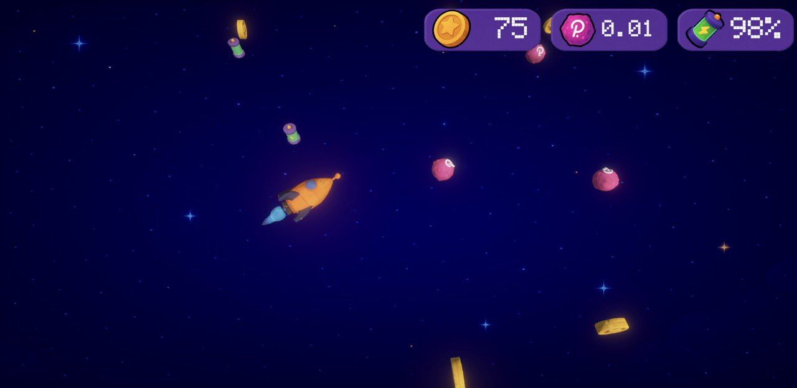
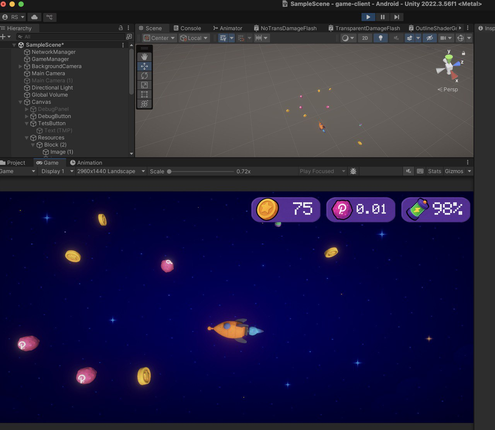
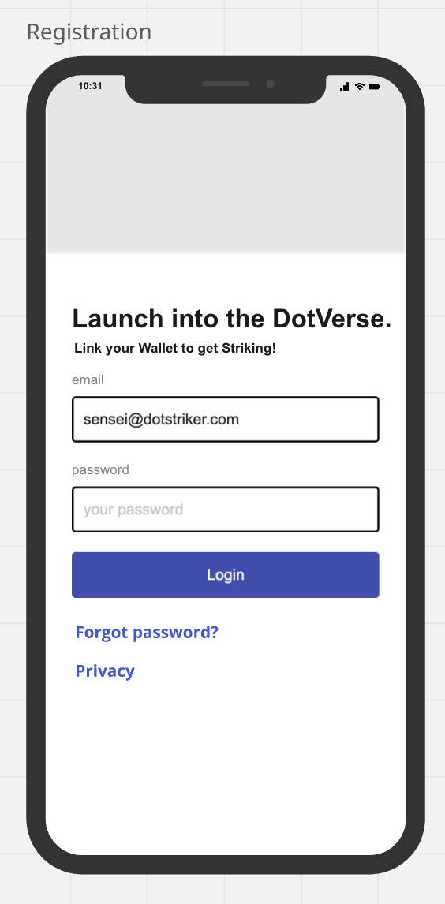

<a id="readme-top"></a>

<!-- PROJECT LOGO -->
<br />
<div align="center">
  <a href="https://github.com/rio900/on-chain-game">
    
  </a>

  <h3 align="center">DotStriker! 🚀</h3>

  <p align="center">
    No shooting. No luck. Just speed, skill, and sync.
    The Striker who collects the most, wins. 🏆
    <br />
    <a href="https://github.com/rio900/on-chain-game/blob/main/README.md"><strong>Explore the docs »</strong></a>
    <br />
    <br />
    <a href="#demo-experience-the-world-of-dotstriker">View Demo</a>
    &middot;
    <a href="#contributing">Contribute</a>
  </p>
</div>

<!-- TABLE OF CONTENTS -->
<details>
  <summary>Table of Contents</summary>
  <ol>
    <li><a href="#-demo-experience-the-world-of-dotstriker">🎥 Demo: Experience the World of DotStriker!</a></li>
    <li>
      <a href="#about-the-project">About The Project</a>
      <ul>
        <li><a href="#game-features">Game Features</a></li>
        <li><a href="#connecting-the-game-client">Connecting the Game Client</a></li>
        <li><a href="#built-with-">Built With ♡</a></li>
        <li><a href="#why-polkadot">Why Polkadot?</a></li>
      </ul>
    </li>
    <li>
      <a href="#live-testing-event">Live Testing Event</a>
    </li>
    <li>
      <a href="#ui-design">UI Design</a>
      <ul>
        <li><a href="#screenshots">Screenshots</a></li>
        <li><a href="#wireframes">Wireframes</a></li>
      </ul>
    </li>
    <li><a href="#future-releases">Future Releases</a></li>
    <li><a href="#meet-the-devs">Meet The Devs</a></li>
    <li><a href="#contributing">Contributing</a></li>
    <li><a href="#contact">Contact</a></li>
    <li><a href="#acknowledgments">Acknowledgments</a></li>
  </ol>
</details>

<!-- DEMO -->

## 🎥 Demo: Experience the World of DotStriker!

[Watch on YouTube](https://youtu.be/eu5RL829t_Q)

<!-- DEMO -->

<!-- ABOUT THE PROJECT -->

## About The Project

 

DotStriker! is a lightning-fast, real-time multiplayer coin race where pilots command NFT starships in a fully on-chain Polkadot arena. Race across the grid, collecting rare NFTs, skins, and Polkdadroids that earn you real DOT, along with energy boosters to keep your ship fueled. When your ship runs out of fuel, the game ends. The player who gathers the most valuable collection wins. No shooting. No luck. Pure speed, skill, and flawless sync. DotStriker! flips Web3 gaming on its head by making the blockchain the game engine itself.

Every move, every reward, every upgrade happens transparently on-chain ie. no servers, no middlemen. The Striker who collects the most coins claims victory. Ready to dominate the arena? 🚀

Link to our first presentation at Consensus 2025 [here](https://www.canva.com/design/DAGnnrlCwj8/4VH96olgLoY4KJUq1WA7uA/view?utm_content=DAGnnrlCwj8&utm_campaign=designshare&utm_medium=link2&utm_source=uniquelinks&utlId=h8acaace07d).
</br>
You can also read about the game on Medium [here](https://oyonika.medium.com/dotstriker-building-a-fully-on-chain-multiplayer-space-game-on-polkadot-737b9c0ecb8e).

## Game Features

DotStriker! isn’t just intended to be a great technical showcase. The ultimate goal is to design the game to be _fun_. We've carefully considered the setting, the motivations that keep players engaged, and how to design gameplay that’s rewarding and emotionally resonant.

#### Visual Identity through NFTs

We use stylized, meme-inspired NFT ships to build emotional attachment. These visuals aren’t just cosmetic—they represent identity, rarity, and value. <br/>


<br/>

⚔️ **Real-Time Multiplayer Battles**  
 Join a fast-paced arena where multiple players pilot NFT starships simultaneously, racing to collect coins, NFTs, and rewards.

🔗 **Fully On-Chain Gameplay**  
 Every move, collection, and upgrade happens transparently on the Polkadot blockchain—no servers, no cheats, no delays.

💰 **Play-to-Earn Economy**  
 Collect rare NFTs like skins and Polkdadroids that grant real DOT rewards. Fuel your ship with energy boosters to stay in the game.

🚀 **Dynamic NFT Ships**  
 Customize your starship’s appearance with unique, meme-inspired NFTs that reflect rarity and style.

⚖️ **Risk & Reward Balance**  
 Enter with DOT, collect scattered resources, and aim to exit with more than you started—real stakes, real gains.

🛠️ **Serverless Experience**  
 No backend, no off-chain APIs—the blockchain _is_ the game engine, ensuring trustless, secure gameplay.

### ▶️ How to Play

- Start by entering the arena with your NFT ship and fueling it with DOT.

- Move your starship across a grid-based space map by initiating short “flights” between coordinates.

- Pick up asteroids containing energy, gold, DOT tokens, or rare NFTs. Energy asteroids keep your ship fueled; if you run out, the game ends.

- Use collected coins and NFTs to upgrade your ship, aiming to gather more than your opponents.

- Your ship consumes energy each move. Keep collecting energy asteroids to stay active. If energy hits zero, you’re out.

- The game ends when a player’s ship runs out of energy. Victory is achieved by collecting more DOT than initially staked, along with rare mystical NFTs, demonstrating superior resource management and strategy.

### 🤓 Gameplay For Nerds

⏳ **On-Chain Game Loop**  
 The pallet’s `on_initialize` hook runs every block to:

- Finalize two-block flights (move ships).
- Spawn and expire asteroids based on TTL and weighted randomness.
- Deduct energy from all active ships.
- Emit DOT and NFT asteroids respecting emission caps and cooldowns.
- Remove ships with zero energy.

🎲 **Asteroid Spawn Logic**  
 Asteroids spawn probabilistically based on game state:

- 10% chance for DOT asteroids
- 20% chance for energy asteroids (restore ship fuel).
- 20% chance for NFT asteroids (subject to cooldown and player count).
- 50% chance for gold asteroids (default).

📐 **Core Data Structures**

- `Coord`: `(x, y)` grid position.
- `Starship`: Position, energy, NFT skin.
- `Flight`: Origin/destination and timing.
- `AsteroidKind`: Resource types (Energy, Gold, DOT, NFT variants).

💾 **Storage and State Management**

- Tracks active ships, flights, asteroids, and player resources.
- Controls emission counters to maintain economic balance.
- Maintains player counts to dynamically adjust game mechanics.

🕹️ **Player Actions (Extrinsics)**

- `start_game(coord, nft_skin)`: Join and place your ship.
- `start_flight(coord)`: Move to a new coordinate over 2 blocks.
- `try_to_collect_resource(coord)`: Attempt to collect an asteroid.

📊 **Economic and Strategic Mechanics**

- DOT rewards capped to maintain scarcity.
- NFT asteroid spawns respect cooldown timers and scale with player count.
- Energy depletion per move requires strategic resource gathering.

🎨 **NFT Visual Identity**

- On-chain minted, meme-inspired ship skins add identity and value.
- Dynamic asset minting occurs transparently and fully on-chain.

#### On-Chain Incentives that Matter

Players are driven by:

- _Long-term goals_: Find and trade rare NFTs.
- _Short-term goals_: Recover more DOT than they staked (e.g., enter with 5 DOT, aim to exit with 10).

#### Gameplay Loop

When a player joins with 5 DOT, that value is scattered as in-game resources across the map—alongside other players’ DOT. **The objective: collect your own and compete for others, all on-chain in real time.**

This balance of visual appeal, risk, and real value makes DotStriker! a compelling on-chain game, not just a tech demo.

## Connecting the Game Client

This repository contains the Polkadot node with a custom game pallet. Follow the steps below to build and run the node locally, and connect the Unity client ([game-client](https://github.com/rio900/game-client)) for testing:

---

### Build the Project

Make sure Rust is installed, then build the project in release mode:

```bash
cargo build --release
```

---

### Start the Node

Launch the node in development mode with runtime logs:

```bash
RUST_LOG=runtime=debug ./target/release/dot-striker-node --dev --execution=wasm
```

---

### Test the Game with the Unity Client

By default, the Unity client uses the Alice address.  
To test multiplayer or a different wallet, that wallet must hold some DOT tokens. **0.15 DOT is sufficient for testing purposes.**

---

### Transfer DOT to a New Wallet Address

To test with a new client wallet:

- **Get the wallet address:**

  - Open the Unity client.
  - Click the `DeviceID` button on the main screen.
  - This generates a wallet address from your device ID.
  - (By default, Alice’s address is pre-filled.)

- **Send DOT to that address:**
  - Go to [polkadot.js.org](https://polkadot.js.org)
  - Connect to your **local node**
  - From the **Alice** account, transfer **0.15 DOT** to the generated client address

---

### Play the Game

Once your client wallet has DOT:

- Press `DeviceID → Ok` in the Unity client
- You’re ready to play! 🚀

Game controls:

1. Press the position on the screen you wish to move to.
2. As the ship arrives at that point, collect as many cosmic spoils within the yellow range.
3. Keep moving and looting until the time runs out!

#### Beta tested this game? Leave your feedback here: https://forms.gle/4eW91Xa2V3KFS3b46

<p align="right">(<a href="#readme-top">back to top</a>)</p>

### Built With ♡

[![Rust][Rust]][Rust-url]
[![Unity][Unity]][Unity-url]
[![Polkadot][Polkadot]][Polkadot-url]

<p align="right">(<a href="#readme-top">back to top</a>)</p>

### Why Polkadot?

> DotStriker! is a fully on-chain, real-time multiplayer space game built with Polkadot, the Polkadot SDK, and a Unity client.

🔧 Why Polkadot SDK (Pallet SDK)?

- 🧩 Runtime pallets (written in Rust) define the game’s core logic — like movement, scoring, and rewards — executed directly in the blockchain runtime.

- ⚡ Low-latency performance via WASM-based runtimes enables responsive real-time gameplay with deterministic, on-chain mechanics.

- 🔐 Polkadot’s shared security and interoperability allow DotStriker! to scale securely and connect to other parachains and ecosystems.

- 🔄 On-chain authority ensures game state and player actions are verifiable, tamper-proof, and transparent — no central game server needed.

🎮 Why Unity?

- 🎨 Unity powers a smooth, real-time visual experience while syncing with on-chain game state using custom networking bridges.

- 📱 Designed for eventual deployment across Web, Desktop, and Mobile platforms with wallet integration and Polkadot identity.

<p align="right">(<a href="#readme-top">back to top</a>)</p>

## Live Testing Event

A group of 5 Polkadot enthusiasts gathered to playtest and review DotStriker! Each participant was registered using their unique device wallet address, enabling a fully decentralized experience without centralized logins. With all five players active, the on-chain engine scaled up in real time, spawning more asteroids, energy units, and resource-rich rewards. The higher player count also unlocked rarer events like NFT skins and Polkadroid drops. This created a chaotic, high-reward environment where players competed over DOT emissions and limited-edition collectibles, all governed by smart logic on the Polkadot blockchain.

Watch the game session: https://youtube.com/shorts/NS_uqveu3jA?feature=share
Watch a player POV: https://youtube.com/shorts/zE8X9ORPqMk?feature=share
Game universe during gameplay for nerds 🤓: https://youtu.be/GnNEFIusZvE

From the feedback, we saw a few things we can smooth out like making it easier to extend ship energy, adding better end screens or alerts when fuel is low, and bringing in music. Overall though, players really enjoyed the game, especially the competitive moments when everyone was racing to grab rare NFTs. Most said they’d play again and would tell their friends about it.

<p align="right">(<a href="#readme-top">back to top</a>)</p>

## UI Design

### Screenshots



### Wireframes

Like many ambitious projects, Dotstrikers! began as a humble proof-of-concept napkin sketch — here’s a glimpse at the game's earliest design ideas.




<p align="right">(<a href="#readme-top">back to top</a>)</p>

<!-- FUTURE RELEASES -->

## Future Releases

<ul>
  <li><b>🪐 Polkadot Hub Integration: </b> Seamlessly connect to the Polkadot ecosystem to store in-game NFTs such as ships, themes, and achievements—secure, portable, and fully on-chain.</li>
<li><b>🌌 Larger Maps & More Players:</b> Scale the game universe with expanded map regions and support for high-concurrency multiplayer sessions, enabling chaotic coin races and team-based missions.</li>
<li><b>☄️ Dynamic Obstacles & Hazards:</b> Introduce asteroids, black holes, and trap zones that challenge navigation and add high-stakes decision-making—impacting speed, score, or survival.</li>
<li><b>⏱️ Timed Levels & Score Pressure: </b> Add countdown-based challenges that reward fast, strategic gameplay—creating replay value and leaderboards based on time efficiency.</li>
<li><b>🚀 NFT-Based Customization & Upgrades: </b> Allow players to collect, trade, and equip unique ships, skins, and boost modules—each minted as NFTs with in-game and marketplace value.</li>
<li><b>🖥️ Cross-Platform Expansion: </b> Optimize for multiple platforms, including desktop, mobile, and browser environments—ensuring broader reach and more accessible play across devices.</li>
</ul>

<p align="right">(<a href="#readme-top">back to top</a>)</p>

<!-- MEET THE DEVS -->

## Meet The Devs

- **Team Name:** DotStriker!
- **Contact Name:** Oyonika Samazder
- **Contact Email:** oyonika@hotmail.com

**Roman Samchuk**
<br />
[![LinkedIn][LinkedIn]][LinkedIn-roman]
[![GitHub][GitHub]][GitHub-roman]

**Oyonika Samazder**
<br />
[![LinkedIn][LinkedIn]][LinkedIn-oyonika]
[![GitHub][GitHub]][GitHub-oyonika]

### Team's experience

The team first connected at Consensus 2025, sparking a collaboration that led to the creation of DotStriker! On our own, we do some pretty cool things too!

Roman has over 14 years of software development experience, including several blockchain-related projects. He developed one of the first Libra blockchain transaction explorers, created a C# SDK for Move smart contracts, and built NFT smart contracts using OpenZeppelin.

Oyonika is a software engineer with interests in cryptography and the cutting-edge world of blockchain. She enjoys designing secure protocols, optimizing on-chain logic, and building robust Web3 infrastructures. She has worked with both startups and established companies, turning ideas into full-stack applications by writing code, shipping features, and scaling systems from the ground up.

<p align="right">(<a href="#readme-top">back to top</a>)</p>

## 📅 Development Roadmap


<!-- GETTING STARTED -->

## Getting Started

To get a local copy up and running, follow these simple example steps:

### Prerequisites

- Rust (with rustup): Install from https://rustup.rs
- Substrate dependencies: Follow the official Substrate installation guide https://docs.substrate.io/install/
- node.js: Install from https://nodejs.org/en/download
- Unity:
- Git: For cloning the repository

### Installation

1. Clone the Repositories

```sh
git clone https://github.com/rio900/on-chain-game
```

2. Build the project in release mode using Cargo:
   ```sh
   cargo build --release
   ```
3. After building, you can start a local development node with runtime debug logging enabled:
   ```sh
   RUST_LOG=runtime=debug ./target/release/dot-striker-node --dev --execution=wasm
   ```
4. Once the node is running, you can interact with it using:
   • Polkadot.js Apps: Connect via https://polkadot.js.org/apps and select the local node.
   • Substrate Front-End Template: Clone and run https://github.com/substrate-developer-hub/substrate-front-end-template to interact with your node.
5. Happy developing!

<p align="right">(<a href="#readme-top">back to top</a>)</p>

<!-- CONTRIBUTING -->

## Contributing

Contributions are what make the open source community such an amazing place to learn, inspire, and create. Any contributions you make are **greatly appreciated**. 🫶🏻

If you have a suggestion that would make this better, please fork the repo and create a pull request. You can also simply open an issue with the tag "enhancement". Don't forget to give the project a star!

1. Fork the Project
2. Create your Feature Branch (`git checkout -b feature/AmazingFeature`)
3. Commit your Changes (`git commit -m 'Add some AmazingFeature'`)
4. Push to the Branch (`git push origin feature/AmazingFeature`)
5. Open a Pull Request

<!-- CONTACT -->

## Contact

Oyonika - [@oyonika](https://www.linkedin.com/in/oyonika)

<p align="right">(<a href="#readme-top">back to top</a>)</p>

<!-- ACKNOWLEDGMENTS -->

## Acknowledgments

This project was made possible thanks to the support of some incredible platforms, collaborators and powerful open-source tools.

- [Rust](https://www.rust-lang.org/)
- [Unity](https://unity.com/solutions/programming)
- [Polkadot](https://polkadot.com/platform/sdk/)
- [EasyA](https://www.easya.io/)
- [Consensus 2025](https://consensus2025.coindesk.com/)

<p align="right">(<a href="#readme-top">back to top</a>)</p>

<!-- MARKDOWN LINKS & IMAGES -->
<!-- https://www.markdownguide.org/basic-syntax/#reference-style-links -->

[Rust]: https://img.shields.io/badge/rust-000000?style=for-the-badge&logo=rust&logoColor=white
[Rust-url]: https://www.rust-lang.org/
[Unity]: https://img.shields.io/badge/unity-153225?style=for-the-badge&logo=solidity&logoColor=white
[Unity-url]: https://unity.com/games
[Polkadot]: https://img.shields.io/badge/polkadot-e5047a?style=for-the-badge&logo=solidity&logoColor=white
[Polkadot-url]: https://docs.polkadot.com/develop/networks/
[LinkedIn]: https://img.shields.io/badge/LinkedIn-0077B5?style=for-the-badge&logo=linkedin&logoColor=white
[LinkedIn-roman]: https://www.linkedin.com/in/roman-samchuk/
[LinkedIn-oyonika]: https://www.linkedin.com/in/oyonika/
[LinkedIn-sami]: https://www.linkedin.com/in/samibr/
[GitHub]: https://img.shields.io/badge/GitHub-100000?style=for-the-badge&logo=github&logoColor=white
[GitHub-roman]: https://github.com/rio900
[GitHub-oyonika]: https://github.com/oyonika
[GitHub-sami]: https://github.com/sibra29
